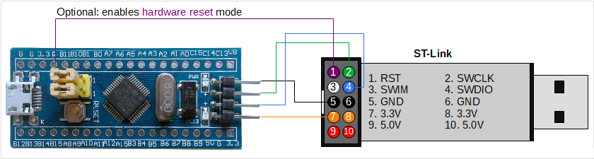
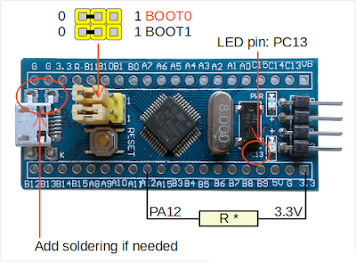
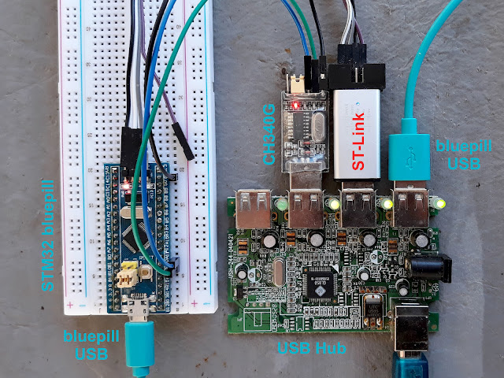
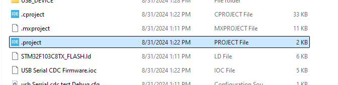
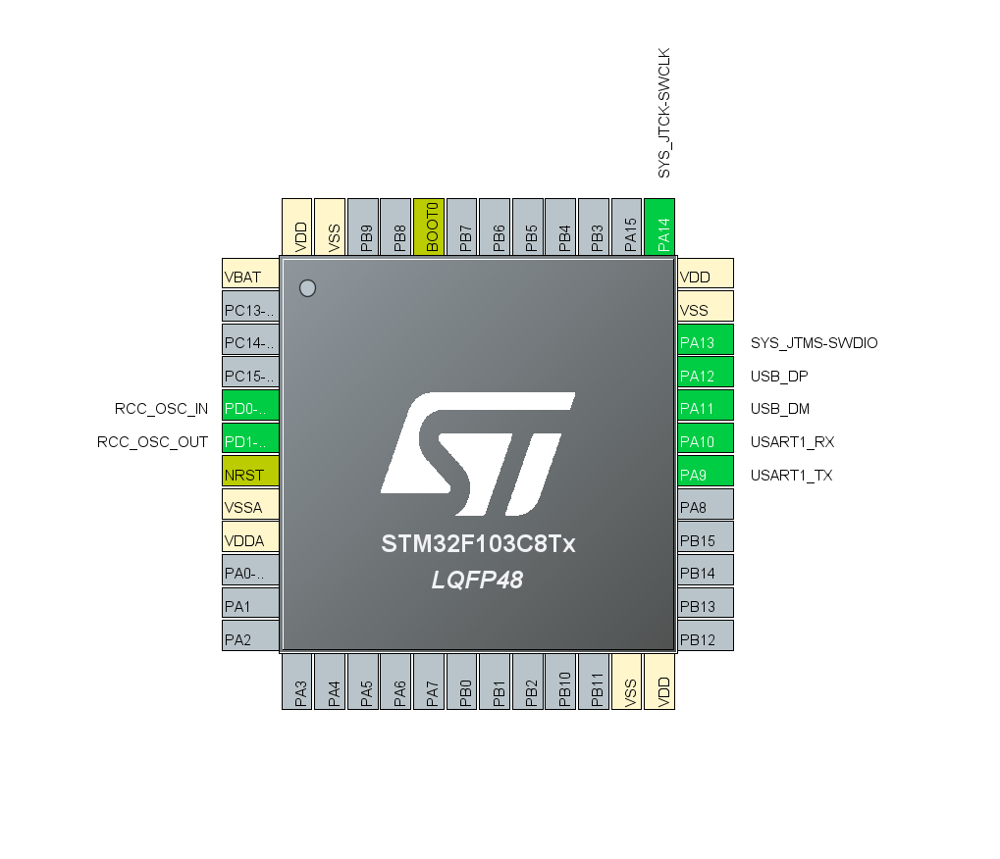
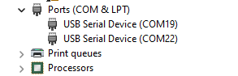

# STM32-CDC-USB-Serial
USB Serial For STM32 Tested On STM32F103XX
For some instance some time we need to add USB comunication with our Devices, for easy implimentaions we can think like widely used UART comunication over STM32 NAtive USB. for this project i am considering STMF103 Serise MCU for the test. 

It can be a good alternatives for Arduino Mico uses.

## Hardware
I have used in expensive i will say populer Blue Pill Board, its populler and its very handy to use. [Many thing can be found here about this board](https://stm32-base.org/boards/STM32F103C8T6-Blue-Pill.html)

 

| Part              | STM32F103C8T6           |
|-------------------|-------------------------|
| **Manufacturer**  | ST-Microelectronics     |
| **Core**          | Arm Cortex-M3           |
| **Max. Clock Speed** | 72 MHz               |
| **Package**       | LQFP 48 pins            |
| **FLASH**         | 64 KiB                  |
| **SRAM**          | 20 KiB                  |
| **HSI**           | 8 MHz                   |
| **LSI**           | 40 kHz                  |
| **HSE**           | 8 MHz                   |
| **LSE**           | 32.768 kHz              |

## Programmer

There are multiple options here. Even the Maple USB bootloader is supported. A popular programming mode is with a USB-Serial adapter. This is possible because STM32 MCUs have an integrated bootloader that handles serial port to flash data transfer. This bootloader is activated by setting BOOT0 jumper to 1. I hate to do this every time I upload binary to flash.

It is very easy to program "blue pill" with ST-Link programmer and even clones do the job. The programmer handles the reset of the board without any user interaction. So, if you haven't yet, get a ST-Link programmer. It connects to the board using 3 or 4 wires (GND, SWCLK, SWDIO). Only if the board is not otherwise powered (from USB port!) connect the 3.3V supply from programmer.

 

 Ensure the Boot pin Jumper Connection to avoid any issues

 

 `Aditional Note: USB D+ is pulled up with R10, which you can find on the back side of the board PCB. If it is not 1.5 k (marked 152) then it may cause troubles when using the USB port. If you have the proper tools, replace it with a similar SMD resistor of 1.5 k. Otherwise, use whatever soldering tool you have and solder a resistor (R*) between pin PA12 and 3.3V. The value of this resistor should be chosen as to get an equivalent resistance of about 1.5 k with the existent R10. R10 is commonly 4.7 k (472) or 10 k (103). Then the resistor (R*) you will solder should be 2.2 k or 1.8 k, respectively.` 

# Final Connection would look like this.
 

## Software
I Have used STMCube IDE to do the work its native from ST Micro Electronics.

## Compile and Run

Just open this File with STMCubeIDE if CubeIDE is installed it shoud open automatically.
 

Run the progam while maintaing the Connection shown above.

-------
# Pinout & Configuration

Here is the [Project Report](./USB%20Serial%20CDC%20Firmware/USB%20Serial%20CDC%20Firmware.pdf) From Cube IDE it includes all pin out and configurations.

## Pin configuration

In a sense I have used the UART in Asynchronous Mode to view Debug prints with `printf()` function and used `CDC_printf()` to print via USB serial.

### My pin out

## USB Configuration

To Change USB Device name and other things we can use the `MANUFACTURER_STRING (Manufacturer Identifier)` and  `PRODUCT_STRING (Product Identifier)` with your name that will be shown in Device tree. 

In windows i found some time it shows as `USB Serial Device (COMXX)`

And For any Reasle Product you shoud use your own Registered PID And VID.

[ ---- All Images are Used From Google Search ---- ]